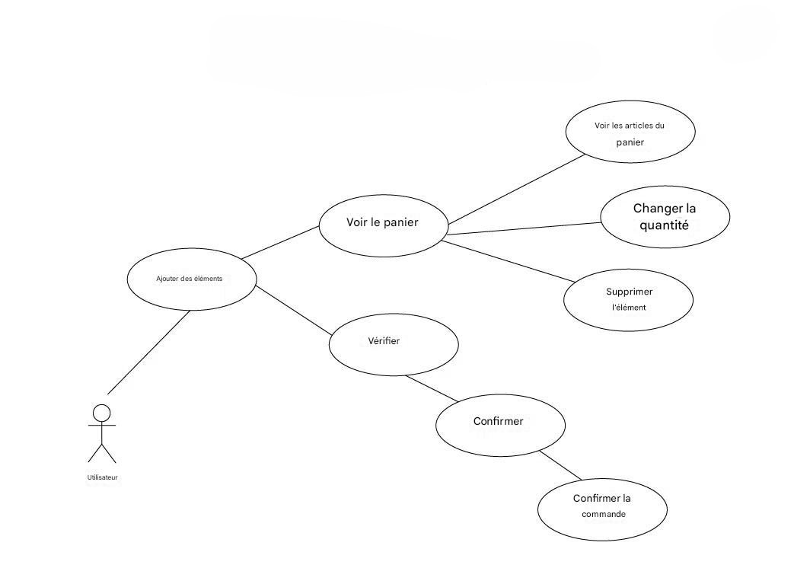
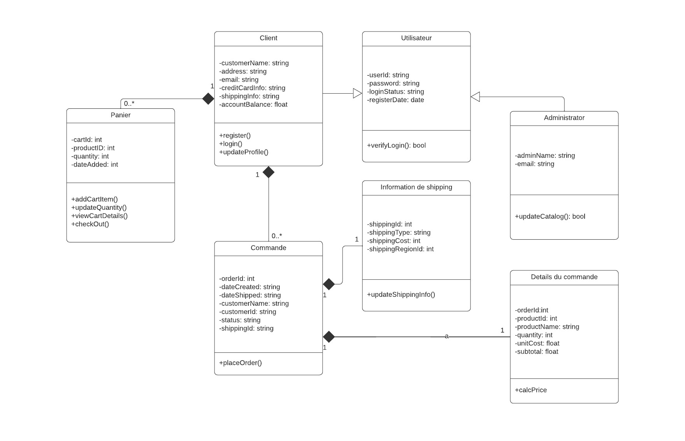
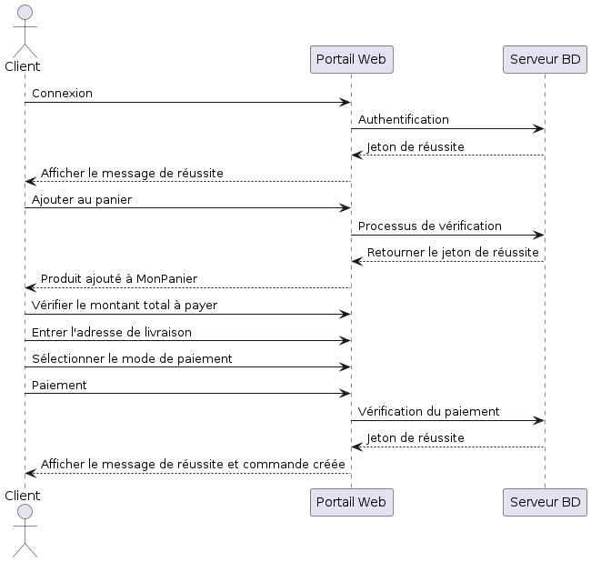
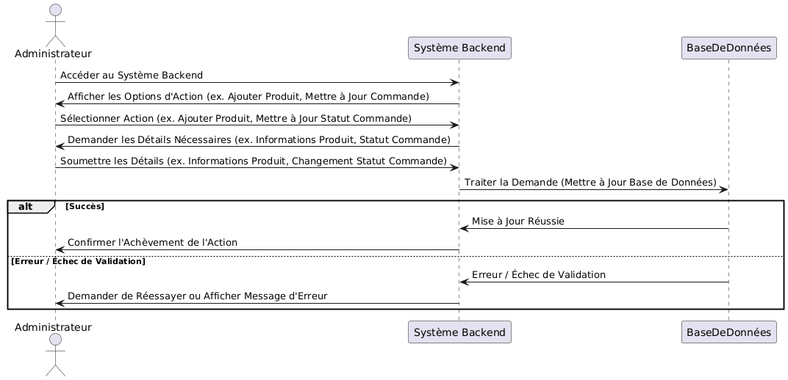
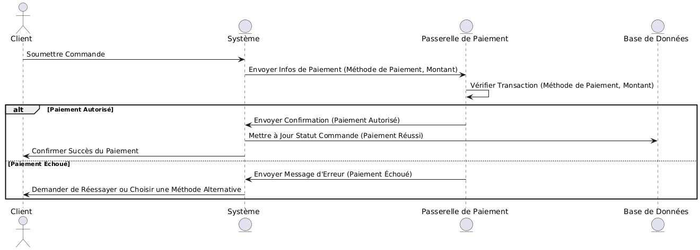
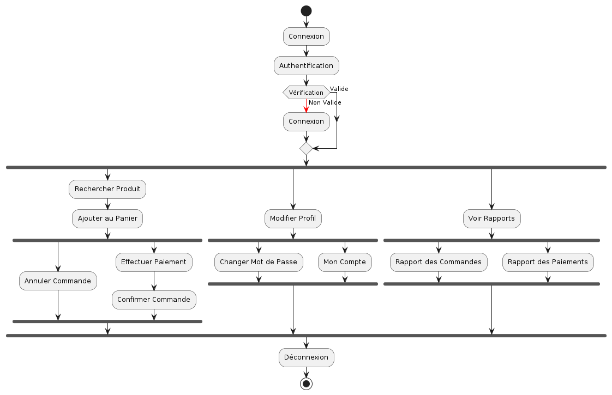

# Plateforme de Shopping en Ligne

## Présentation du Projet
**Nom :** Plateforme de Shopping en Ligne  
**Description :** Une plateforme complète de shopping en ligne permettant aux utilisateurs d'acheter, de vendre et de gérer des produits dans plusieurs catégories.  
**Technologie principale :** Python (Django Framework)  
**Public cible :** Tout utilisateur ayant accès à Internet.

---

## Objectifs
- Permettre aux utilisateurs de parcourir des produits, de les ajouter à leur panier et de les acheter.
- Fournir une interface pour les administrateurs afin de gérer les produits, commandes et utilisateurs.
- Assurer une expérience utilisateur fluide et intuitive.
- Garantir la sécurité des transactions et la protection des données des utilisateurs.

---

## Fonctionnalités Principales

### 1. Page d'Accueil
- **Slider Promotionnel :** Mise en avant des offres et promotions.
- **Produits Recommandés :** Présentation des articles populaires ou suggérés.
- **Barre de Recherche Avancée :** Recherche rapide et efficace.

### 2. Catalogue des Produits
- **Organisation par Catégories :** Liste des produits triés par catégories.
- **Filtres :** Prix, marque, note des utilisateurs, etc.
- **Tri :** Prix (croissant/décroissant), popularité, et autres.

### 3. Fiche Produit
- **Informations Détailées :** Titre, description, images, prix.
- **Avis des Utilisateurs :** Évaluations et commentaires.
- **Boutons d'Action :** "Ajouter au panier" et "Acheter maintenant".

### 4. Panier
- **Aperçu des Produits :** Liste des articles ajoutés avec leurs détails.
- **Bouton de Paiement :** Redirection vers la page de paiement.
- **Calculs Automatiques :** Sous-total, frais de livraison et total.

### 5. Paiement
- **Méthodes Disponibles :** Intégration avec carte bancaire, PayPal, etc.
- **Résumé de Commande :** Affiché avant la validation finale.

### 6. Compte Utilisateur
- **Inscription/Connexion :** Via email et mot de passe.
- **Historique des Commandes :** Suivi des achats passés.
- **Gestion du Profil :** Mise à jour du nom, adresse, téléphone, etc.

---

## Architecture Technique

### 1. Technologies Utilisées
- **Back-end :** Python (Django REST Framework pour l'API).
- **Front-end :** Templates Django, Bootstrap.
- **Base de Données :** MySQL.
- **Hébergement :** AWS, Heroku ou autre service cloud.
- **Stockage des Médias :** AWS S3 ou similaire.

### 2. Sécurité
- **Chiffrement HTTPS :** Pour sécuriser les transmissions de données.
- **Gestion des Mots de Passe :** Via `django.contrib.auth`.
- **Protection Contre les Attaques :** Défense contre les attaques CSRF et XSS.
- **Validation des Données :** Contrôles stricts des entrées utilisateur.

### 3. Modules Tiers
- `django-allauth` : Pour l'authentification et la gestion des utilisateurs.
- `django-crispy-forms` : Pour une gestion optimisée des formulaires.
- SDK Stripe/PayPal : Pour des paiements en ligne sécurisés.

---

## Diagramme de Cas d'Utilisation
Voici un diagramme de cas d'utilisation pour un projet de site Web de commerce électronique :

## Diagramme de Classe
Le diagramme de classe pour un site Web de commerce électronique décrit simplement la structure de la classe du site Web de commerce électronique, les attributs, les méthodes ou les opérations, la relation entre les objets.

## Diagrammes de sequence
### Diagramme de sequence du Website

### Diagramme de sequence d'Admin

### Diagramme de sequence de Paiment

## Diagrammes d'activite

